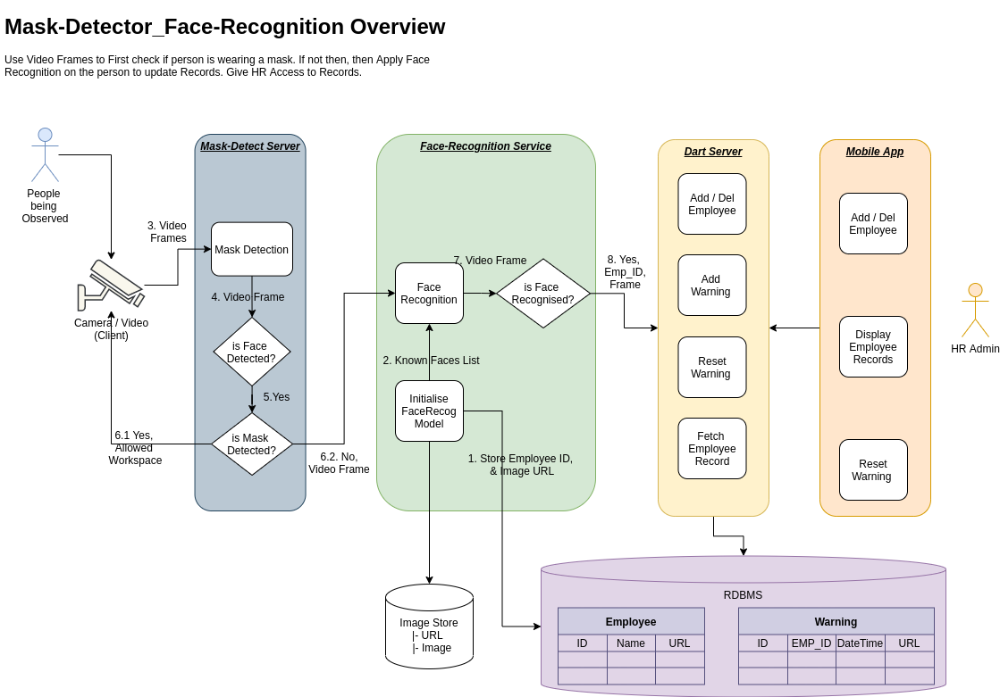

# Final_Year_Project

FOR LINUX :

Navigate to /home/xyz/github/Mask_Detection_Face_Recognition_Service/

Run Mask-Detection_Face-Recognition Server :

    |- python3 -m Mask_Detection_Face_Recognition.Mask_Face_Server

Run Mask-Detection_Face-Recognition Client :

    |- python3 -m Mask_Detection_Face_Recognition.Mask_Face_Client

FOR WINDOWS:

WARNING : WINDOWS DOESN'T SUPPORT WEBCAM USAGE! ONLY .mp4 FILES WORK!

Navigate to /users/xyz/github/Mask_Detection_Face_Recognition_Service/

Run Mask-Detection_Face-Recognition Server :

    |- python -m Mask_Detection_Face_Recognition.Mask_Face_Server

Run Mask-Detection_Face-Recognition Client :

    |- python -m Mask_Detection_Face_Recognition.Mask_Face_Client