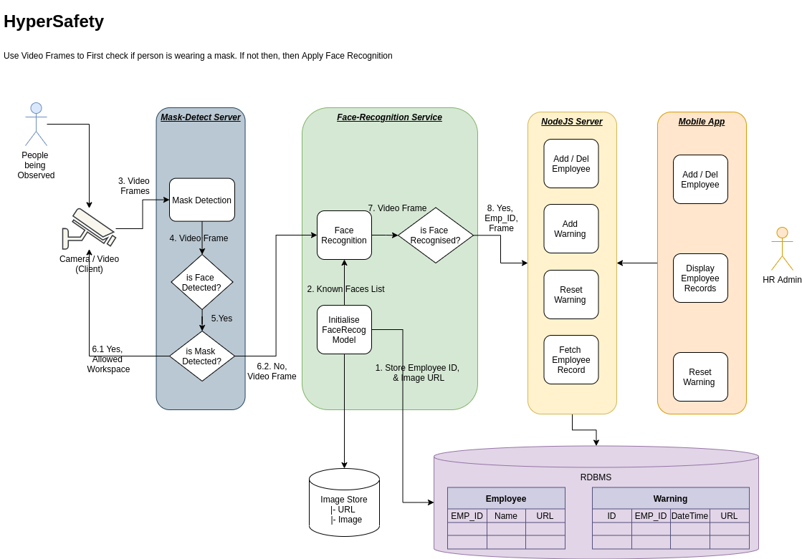

# HyperSafety
## Mask-Detection & Face-Recognition Service for Safety in Work Places.

FOR LINUX :

Navigate to /home/xyz/github/HyperSafety_Service/

Run HyperSafety Server :

    python3 -m HyperSafety.HyperSafety_Server

Run HyperSafety Client :

    python3 -m HyperSafety.HyperSafety_Client

FOR WINDOWS:

WARNING : WINDOWS DOESN'T SUPPORT WEBCAM USAGE! ONLY .mp4 FILES WORK!

Navigate to /users/xyz/github/HyperSafety_Service/

Run HyperSafety Server :

    python -m HyperSafety.HyperSafety_Server

Run HyperSafety Client :

    python -m HyperSafety.HyperSafety_Client